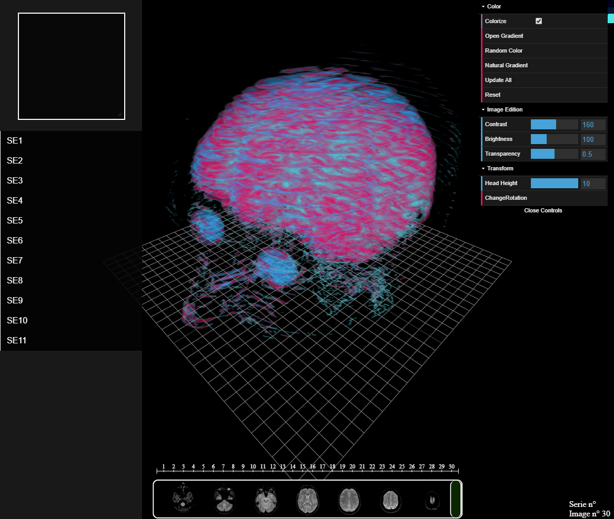
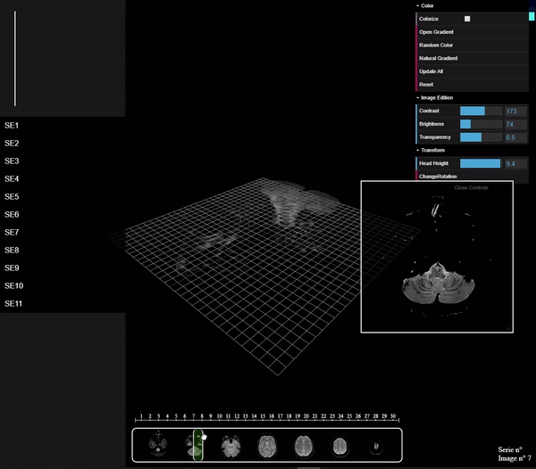

# IRM_Visualizer
3D IRM scan visualizer made with three.JS

Interface            
:-------------------------:
    

## Build With

Any additional information goes here

- JavaScript
    - JQuery
    - DatGui
    - StatsJS
    - ThreeJS
    - NodeJS

- Html
- CSS

Framework : Electron

## Screenshots

Example #1                 |  Example #2               | Example #3
:-------------------------:|:-------------------------:|:-------------------------:
   |  |  

## Demo

Demonstration gifs
Gif #1                     |  Gif #2     |  Gif #3    
:-------------------------:|:-------------------------:|:-------------------------:
       |    |  

 ## Usage
 
 Place your all the folder that contain the scans in src/ressource/images
 The folders must be names "SE1", "SE2", "SE3", etc.
 
 To use the src files, place them in a electron projet, electron being the framework used in this project

